# Dashcam in the iOS Simulator

From main at 16e0731ea91fdf9f543ba15c9715e283c356d6ba.

Screenshots taken by the UI tests in the iOS Simulator with the simulated camera. The Simulator
has no camera, so the preview area stays empty; on an iPhone it shows the rear camera.

Screen recording of the whole UI test run: [ui-tests.mp4](ui-tests.mp4)

## 01 Welcome

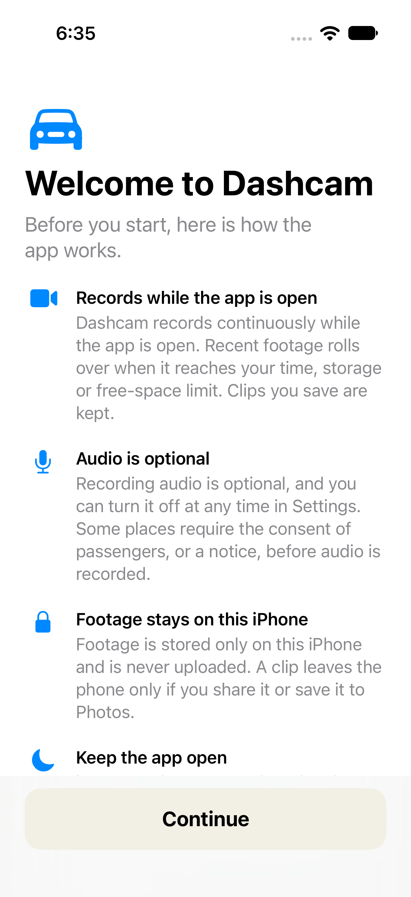

## 02 Ready to record

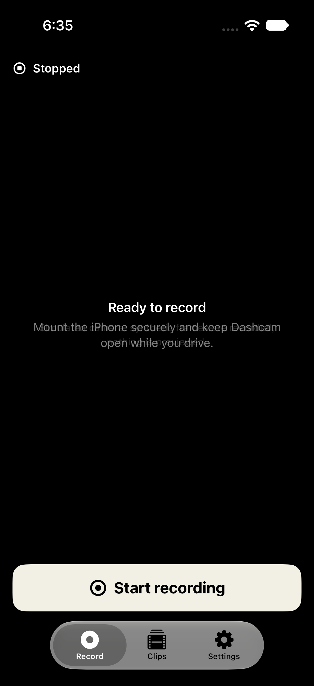

## 03 Recording

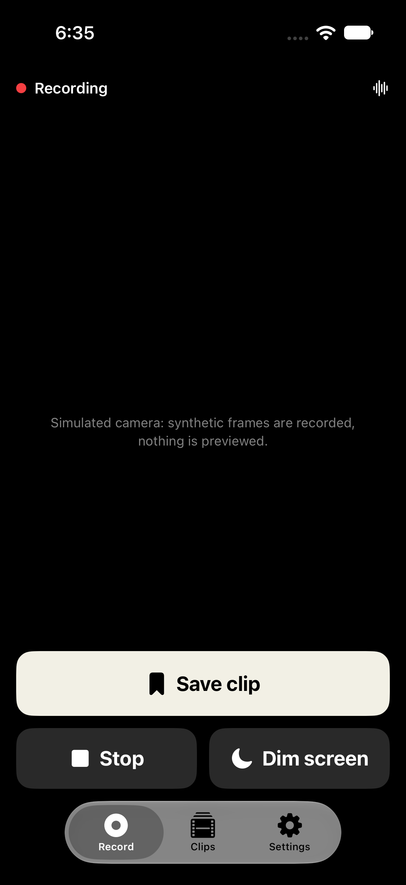

## 04 Saving an incident

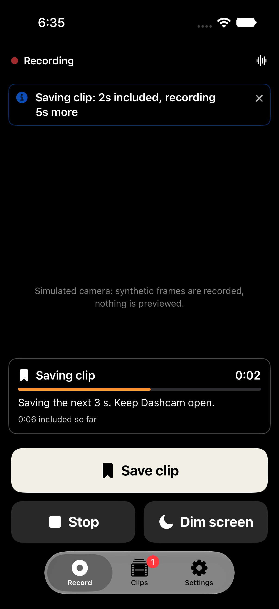

## 05 Clips

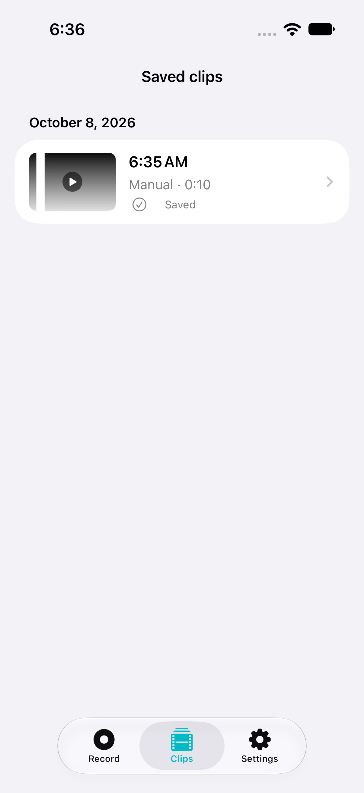

## 06 Clip

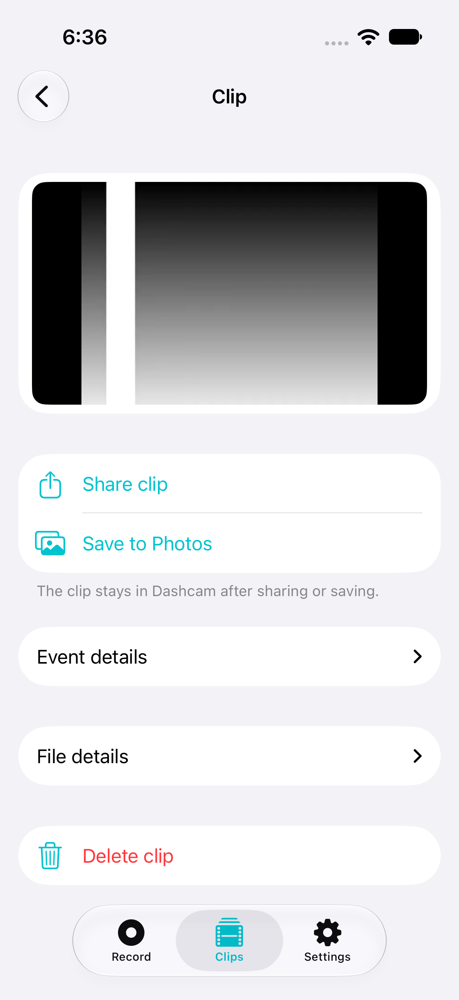

## 07 Dimmed

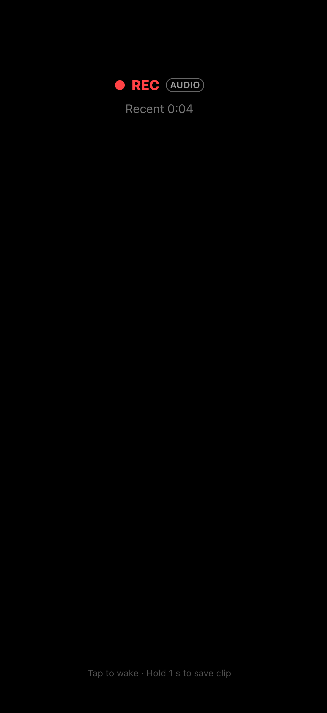

## 08 Dimmed, saving an incident

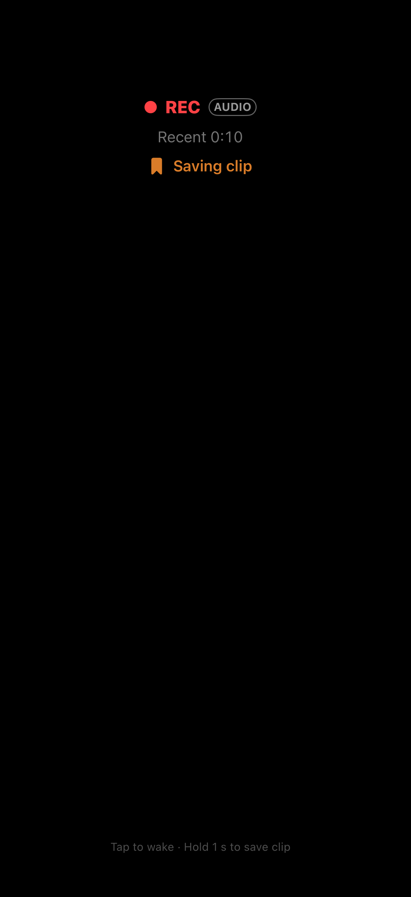

## 09 Settings

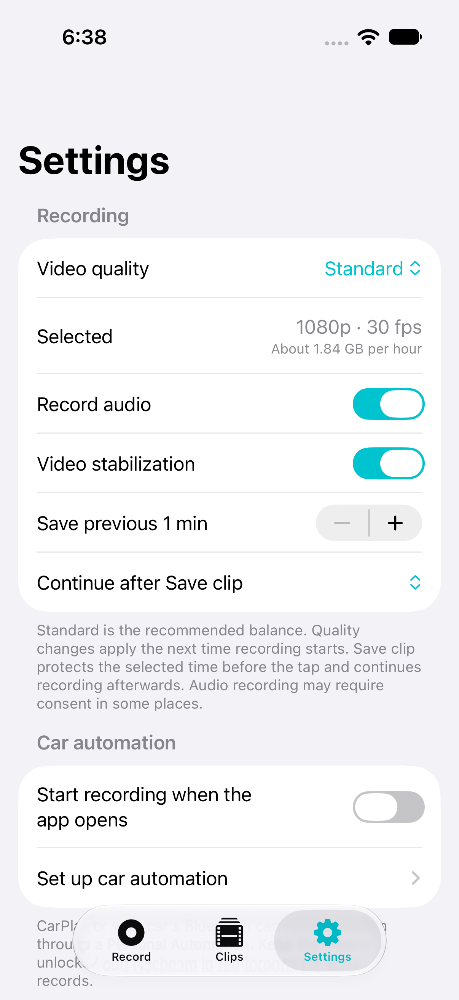

## 10 Developer tools

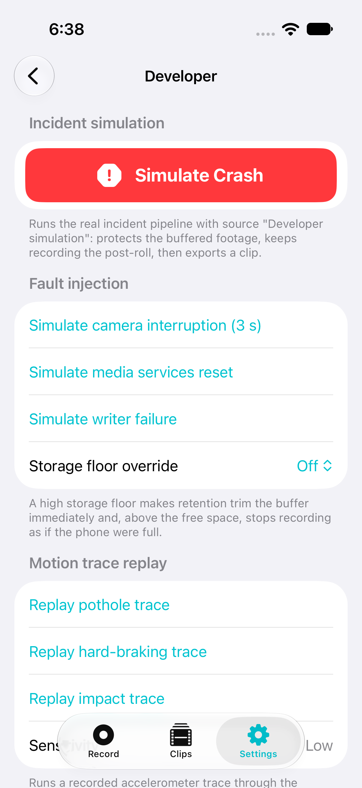

## 11 Camera access off

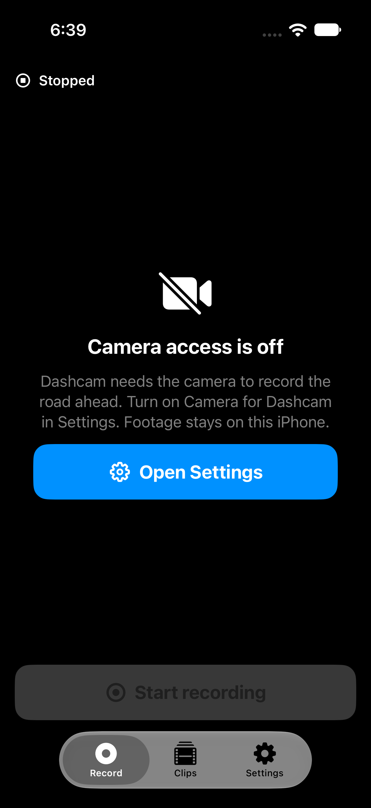

## 12 Empty clips dark

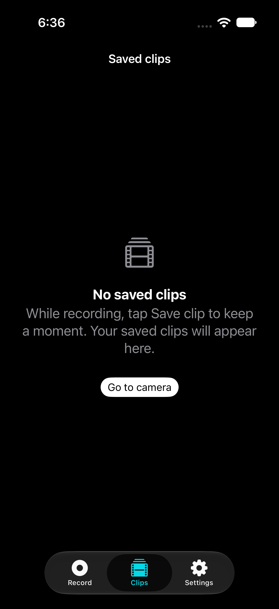

## 12 Empty clips light

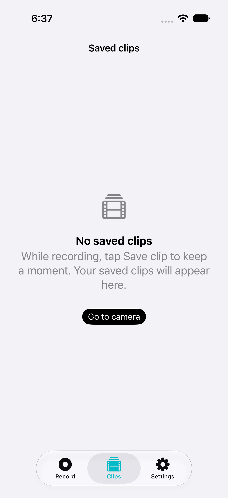

## 13 Compact clips dark

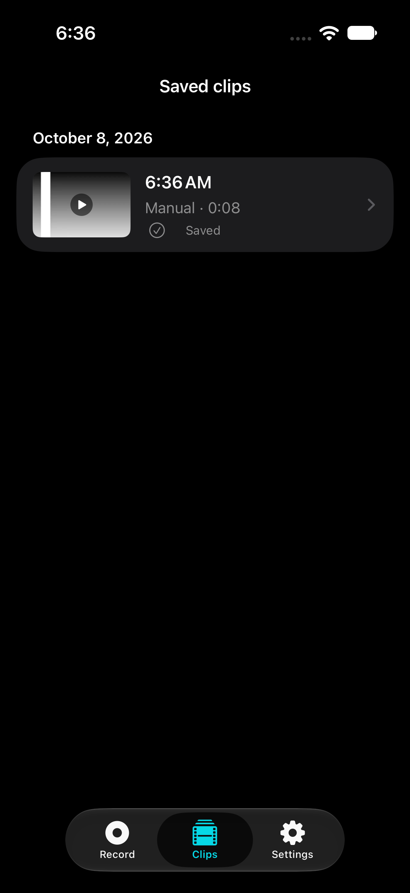

## 13 Compact clips light

## 14 Clip actions dark

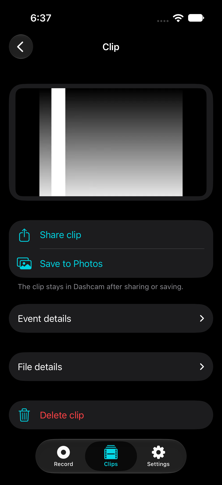

## 14 Clip actions light

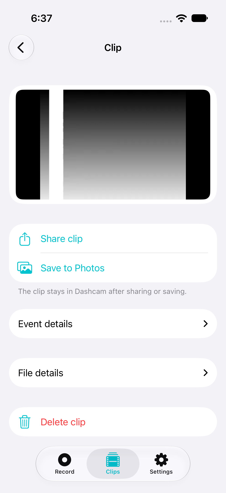

## 15 Settings dark

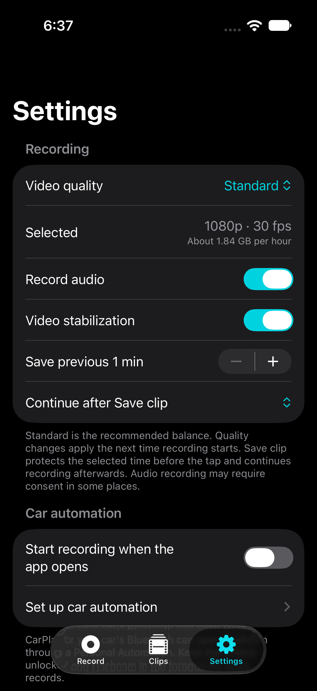

## 15 Settings light

## 16 Landscape clips dark

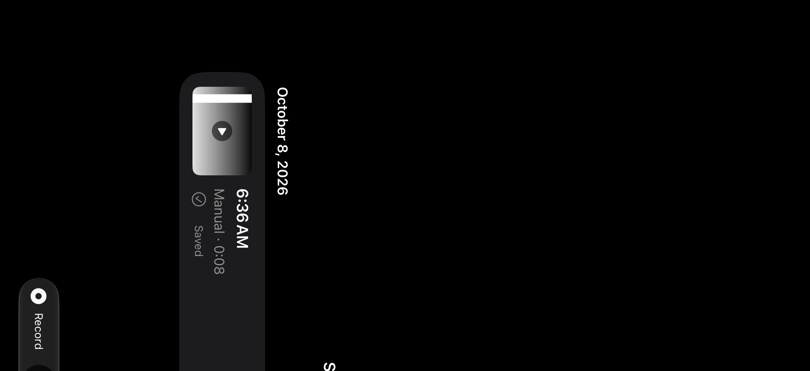

## 16 Landscape clips light

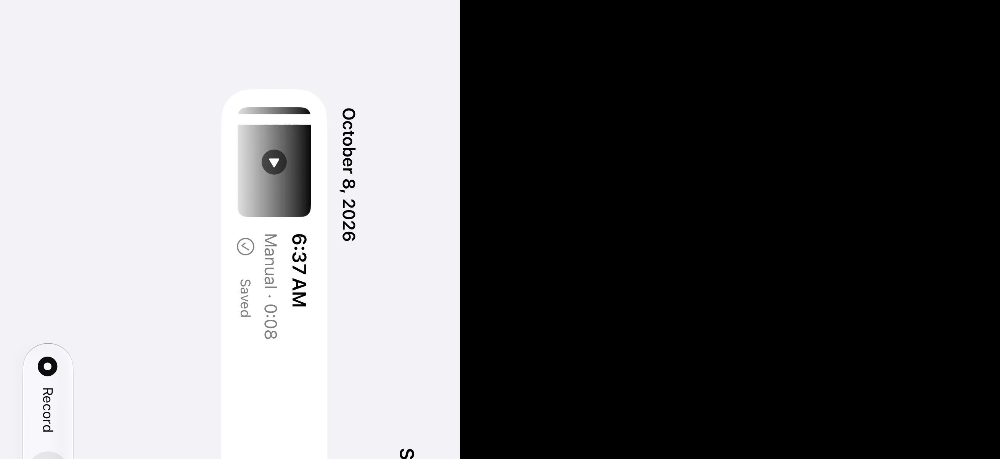
