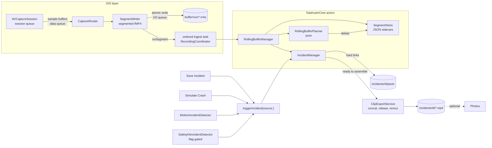

# Architecture

The app is split in two. `Sources/DashcamCore` is a platform-independent Swift package (Swift 6 language mode, strict concurrency) that decides what footage to keep, what to delete and what belongs to an incident; it builds and tests on Linux. `App/Dashcam` is the iOS layer: it owns AVFoundation, UIKit, Core Motion, Photos and SafetyKit, produces segment files and reports events to the core. The app target uses Swift 5 language mode with targeted concurrency checking so the AVFoundation delegate code compiles without a long fight.

Four rules shape both halves. Footage already on disk is never put at risk by anything else the app does. Every incident source goes through one entry point. Recording happens only in the foreground, because iOS allows nothing else (see PLATFORM_REVIEW.md). Anything that can be a pure function is one, so it can be tested without a phone.

## Components

| Brief name | Implementation | Responsibility |
|---|---|---|
| CameraCaptureService | `CameraCaptureService` | Owns the `AVCaptureSession` on a serial session queue. Back wide camera, explicit 1920x1080 '420v' format at 30 fps (session preset as fallback), video and audio data outputs on the data queue, stabilization, HDR off, mix-with-others audio, rotation coordinator. Forwards interruptions, runtime errors and system pressure. Knows nothing about files. |
| SegmentRecorder | `SegmentWriter`, `CaptureRouter` | One `AVAssetWriter` per run in segmented fMP4 mode; writes each segment atomically. The router hands sample buffers to the current writer and swaps writers on the data queue. |
| RollingBufferManager | `RollingBufferManager` (actor) | For each finished segment: index it, offer it to incidents, enforce retention. |
| StorageManager | `SegmentStore` (actor), `RollingBufferPlanner`, `RetentionPolicy`, `StorageStatus` | The store owns files and JSON sidecars and rebuilds its index at launch. The planner is a pure deletion decision. Status is ok, low or critical. |
| IncidentManager | `IncidentManager` (actor) | The single `trigger(source:note:occurredAt:)`. Links footage, collects post-roll, persists manifests, recovers at launch, drives assembly. |
| IncidentDetector and its implementations | `IncidentDetector` protocol; `MotionIncidentDetector` with the core `MotionImpactDetector`; `SafetyKitIncidentDetector` | Automatic sources. The Save Incident button and the developer Simulate Crash call the coordinator directly, so there is no separate ManualIncidentDetector. |
| ClipExportService | `ClipAssemblyPlanner`, `FMP4ClipAssembler`, `FMP4` (core); `ClipExportService` (app) | Group parts by run, concatenate and rebase, remux to a conventional MP4, save to Photos. |
| LocationService | Deferred | Not implemented. |
| AppLogger | `DashcamLogger` with `InMemoryLogSink`, `FileLogSink`, `OSLogSink` | Fan-out logging. |
| (not in brief) | `RecordingCoordinator`, `RecorderStateMachine`, `AppSettings`, `AppPaths` | Lifecycle, permissions, interruptions, recovery, thermal policy, watchdog, ordered ingestion; a pure state reducer; persisted settings; directory layout. |

The UI has three tabs, Record, Clips and Settings, with a Developer section for test tools, plus a first-run consent screen and a full-screen dim mode. Record shows the preview, start and stop, the Save Incident button and status chips (buffer length, storage, "Not charging"). Dim mode is a black overlay with lowered brightness and a small REC indicator; tap wakes it, a long press saves an incident.

## Why segmented AVAssetWriter

AVCaptureMovieFileOutput was rejected first. On iOS it must stop before it can start a new file, so every rollover leaves a gap, and it stops recording when the app backgrounds.

Two alternating AVAssetWriters would avoid the gap but not the seams. Audio sample buffers carry about 1,024 frames (roughly 21 ms), so a buffer must go to one writer or the other and each boundary gets a small A/V skew. Each new file re-primes AAC (an edit of about 48 ms), so stitched clips can click. Two hardware encoder sessions briefly coexist, and every file starts with an IDR frame.

A single writer in segmented mode keeps one encoder session and one continuous timeline. The encoder is forced to emit a sync sample at each interval boundary, and each segment arrives as a complete `Data` value the app can write atomically. The costs are that media segments are not playable without their run's initialization segment, that a run has one fixed configuration (any restart begins a new run), and that clips must be assembled.

## Data flow

1. The capture service delivers `CMSampleBuffer`s on the data queue. `CaptureRouter` records frame statistics for the watchdog and passes each buffer to the current `SegmentWriter`.
2. The first video frame starts the writer: `initialSegmentStartTime` and `startSession(atSourceTime:)` both take its presentation time, and the host-clock time is mapped to wall-clock time so the core can reason in `Date`s.
3. The writer (`AVAssetWriter(contentType: .mp4)`, profile `.mpeg4CMAFCompliant`, interval 4 s by default and 2 to 30 s in developer settings) emits an initialization segment, then a media segment per interval. Video settings come from `recommendedVideoSettings(forVideoCodecType: .hevc, ...)` with 4.5 Mb/s at 1080p (2.4 Mb/s at 720p), keyframe interval equal to the segment interval and frame reordering off, falling back to H.264; audio is AAC from `recommendedAudioSettingsForAssetWriter`. The track transform is the rotation coordinator's horizon-level angle at run start.
4. On the writer's I/O queue each segment is written atomically to `buffer/<run>/init.mp4` or `000001.m4s`, its wall-clock start and duration are taken from the segment report, and `onSegment` fires.
5. `onSegment` feeds an `AsyncStream` that a single coordinator task consumes in order. `RollingBufferManager.ingest` has `SegmentStore` write the sidecar (only after the media file exists), lets `IncidentManager` attach the segment to collecting incidents, then runs `RollingBufferPlanner` and deletes what it returns.
6. A trigger builds the window [T minus pre-roll, T plus post-roll]. Every overlapping buffer segment, plus the run's initialization segment, is hard-linked into `incidents/<id>/parts`. The incident collects new segments until one ends at or after the window end, then becomes ready to assemble.
7. Assembly groups parts by run. For each run, the initialization segment and media segments are concatenated with `tfdt` and `sidx` times rebased so the clip starts at zero, then remuxed by passthrough `AVAssetExportSession.export(to:as:)` into a conventional MP4. If the remux fails the fragmented file is kept. Parts are released afterwards. Saving to Photos is optional; the in-app copy remains the source of truth.

Assembly writes the concatenated and the remuxed file before releasing parts, so it briefly needs about twice the clip size in free space (a default clip is about 205 MB).



## Runs, segments and incidents

A run is one writer lifetime, identified by a `RunID` such as `run-1759154400-1a2b3c4d`. A new run starts when recording starts, on resume after an interruption or backgrounding, and after a writer failure. Each run has its own initialization segment, and its media segments are playable only with it.

A `Segment` records its run, sequence number, kind (initialization or media), wall-clock start, duration, byte count, relative path and whether it completed. Wall-clock times let retention ("the last five minutes") and incident windows work across runs.

Retention runs after every ingested segment and at launch. The planner first expires unprotected media segments that ended more than the target duration ago (5 minutes by default). It then deletes the oldest unprotected segments while over an optional byte cap or under the free-space floor (1 GB by default). Last, it removes initialization segments whose run has no media left and is not active. Storage is low below twice the floor and critical below the floor; critical refuses to start and stops recording.

An `Incident` holds its triggers, window, parts, state (collecting, readyToAssemble, assembling, complete, failed) and clip paths. Pre-roll defaults to the whole buffer length and post-roll to 60 s. A trigger that lands inside a collecting incident's window extends it rather than opening a second one. A trigger whose `occurredAt` lies far enough in the past, as SafetyKit's do, builds its window retroactively and is ready at once. `manifest.json` is rewritten atomically on every change. If linking fails the file is copied; if that fails too, the buffer copy is marked protected so retention skips it. When recording stops, collecting incidents close with what they have. An incident that spans two runs yields two clip files.

## On-disk layout

```
Library/Application Support/Dashcam/
  buffer/                          excluded from backup
    run-<unix time>-<8 hex>/
      init.mp4, init.json          initialization segment and sidecar
      000001.m4s, 000001.json      media segment and sidecar
  incidents/                       included in backup (product decision pending)
    <UUID>/
      manifest.json
      parts/<run>_000123.m4s       hard links while collecting, removed after assembly
      incident-<yyyyMMdd-HHmmss>.mp4
      incident-<...>-part2.mp4     second run, if any
  logs/                            excluded from backup
    dashcam.log, dashcam.1.log     2 MB with one rotation
```

Nothing goes in tmp/ or Caches/. Files use the default protection class (complete until first unlock); the Data Protection capability is deliberately not enabled. At launch `SegmentStore.load()` rebuilds the index from sidecars and removes orphan files, dangling or corrupt sidecars and empty run directories.

## Threading

`RecordingCoordinator`, the detectors and the UI run on the main actor. Operations that finish or start a writer (start, stop, pause, resume, recover, run rotation) are transitions and only one runs at a time. A request that arrives during a transition is recorded rather than dropped (stop, a writer failure, a rotation) and `reconcile()` acts on it, and on the session's real state (`isInterrupted`, `isRunning`, whether frames are flowing, foreground or background), the moment the transition ends; the watchdog repeats the same reconciliation every 5 s. Finishing a writer is one shared operation: concurrent callers (camera interruption and did-enter-background both arrive on backgrounding) wait for the same teardown, so nobody releases the background task while the last segment is still being flushed. A `finishWriting` that never calls back is abandoned after 15 s with a fault in the log so transitions cannot freeze. The capture service mutates the session only on its serial session queue. Both data outputs deliver on one serial data queue, where the router forwards buffers; writer swaps and `finish` are scheduled on the same queue so a writer is never finished mid-append (a lock guards only the reference and the watchdog's counters). Each `SegmentWriter` persists segments on its own serial I/O queue. From there, segments pass through the ordered ingest stream into the core actors: `RollingBufferManager` calls `SegmentStore` and `IncidentManager` in sequence. Core Motion delivers on a one-at-a-time operation queue, with detector state under a lock and events hopping to the main actor. Capture notifications and the system-pressure observation are forwarded to the main actor.

## Failure handling

| Event | Response |
|---|---|
| Screen lock or backgrounding | A background task is armed at will-resign-active. At did-enter-background the run is finished (the last partial segment is delivered) and ingestion drained, then the task ends. Did-become-active starts a new run. |
| Audio taken by a call or alarm | Video continues: the run is rotated to a video-only writer, and rotated again with audio when the interruption ends. The watchdog ignores `isInterrupted` while frames keep flowing. |
| Any other interruption | Finish the run and wait; interruption-ended, did-become-active or the reconciliation after the pause resumes with a new run. |
| Interruption-ended never arrives | The watchdog resumes once `session.isInterrupted` is false for 5 s, and pauses if the session reports interrupted while recording and frames have stopped. |
| Runtime error, including media services reset | Finish the run, tear down (reset) or stop the session, wait 1 s, resume, all inside one transition. After three attempts without a media segment reaching disk in between, fail with a "restart the phone" message. |
| No video frames for 8 s | The watchdog (5 s tick) runs the same recovery. |
| Frames flow but no segment reaches disk for 3 intervals (at least 15 s) | The watchdog rotates the writer as a writer failure. |
| Writer failure (append rejected, writer failed asynchronously, segment file could not be written) | Finish the run and start a new one; more than three in two minutes fails the session. `finish` checks `AVAssetWriter.status` first so a failed writer is never finished (that raises an exception). |
| Phone rotated into its mount after Start | The writer's transform is fixed per run, so after the orientation has been stable for 2 s the run is rotated with the new angle. |
| Audio switched on or off in Settings while recording | The run is rotated with the right tracks, rebuilding the capture graph if the microphone was not in it. |
| Storage critical while recording | Recording stops from a separate task; stopping inline from the ingest loop would deadlock the drain barrier. |
| Save Incident while not recording | The incident is closed at once with the buffered footage and exported; it cannot wait for a post-roll that will never come. |
| System pressure or thermal state serious / critical | 24 fps / 15 fps. At pressure shutdown AVFoundation interrupts the session, handled as an interruption. |
| Storage low / critical | Warning / refuse to start or stop recording. Protected footage is never deleted. |
| Retention deletion fails | Logged; retention continues. |
| App killed | At most one segment interval lost. At launch the index is rebuilt, collecting incidents become ready to assemble (failed if empty) and are assembled. |
| Crash event in a cold background launch | The trigger takes a background task, loads storage first, protects footage retroactively and dedupes by event date. |
| Remux fails / Photos denied | Keep the fragmented MP4 / keep the in-app copy. |
| Camera denied / microphone denied | Start fails with a pointer to Settings / record video only. |
